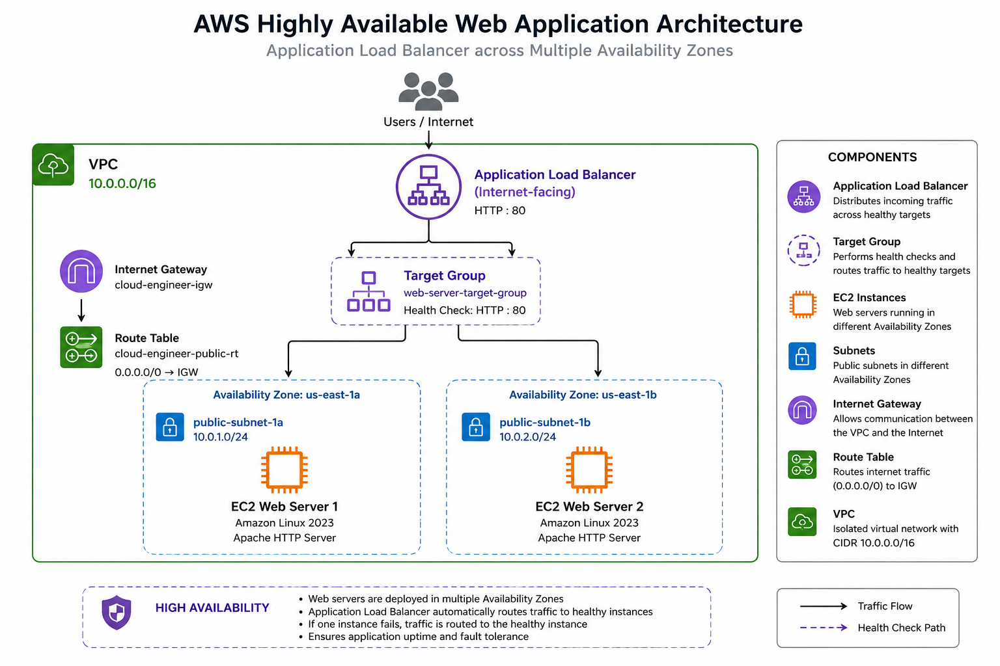

\# AWS Highly Available Web Application

A highly available web application deployed on AWS using Amazon VPC, EC2, and an Application Load Balancer across multiple Availability Zones.

\## 🚀 Project Overview

This project demonstrates how to design and deploy a highly available web application using AWS networking and compute services.

Two Amazon EC2 web servers are deployed in separate Availability Zones and placed behind an Application Load Balancer. The ALB performs health checks and automatically routes traffic to healthy instances.

## 🏗️ Architecture

The application is deployed across two Availability Zones using Amazon EC2 and an Application Load Balancer. The ALB performs health checks and routes incoming traffic to healthy EC2 instances.