# AWS Highly Available Web Application

A highly available web application deployed on AWS using Amazon VPC, EC2, and an Application Load Balancer across multiple Availability Zones.

## 🚀 Project Overview

This project demonstrates how to design and deploy a highly available web application using AWS networking and compute services.

Two Amazon EC2 web servers are deployed in separate Availability Zones and placed behind an Application Load Balancer. The ALB performs health checks and automatically routes traffic to healthy instances.

## 🏗️ Architecture

The application is deployed across two Availability Zones using Amazon EC2 and an Application Load Balancer. The ALB performs health checks and routes incoming traffic to healthy EC2 instances.

## ☁️ AWS Services Used

- Amazon VPC
- Amazon EC2
- Application Load Balancer
- Target Groups
- Internet Gateway
- Route Tables
- Security Groups
- Availability Zones

## 📸 Project Screenshots

### 1. VPC Configuration

Shows the custom `cloud-engineer-vpc` with CIDR block `10.0.0.0/16`, providing the isolated network environment for the application.

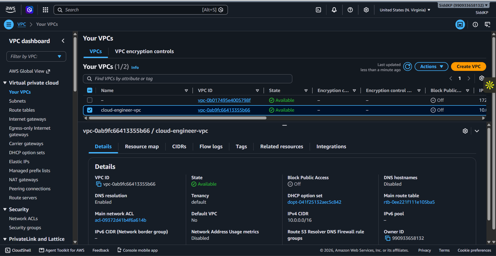

### 2. Subnets Across Availability Zones

Shows the two public subnets, `public-subnet-1a` and `public-subnet-1b`, deployed across different Availability Zones for high availability.

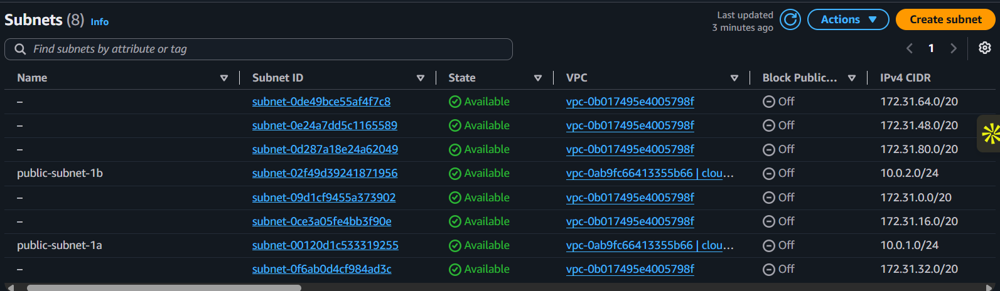

### 3. Internet Gateway

Shows the Internet Gateway attached to the VPC, enabling communication between the VPC resources and the Internet.

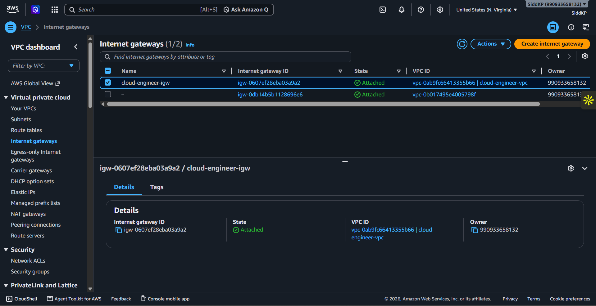

### 4. Route Table

Shows the public route table with the `0.0.0.0/0` route directed through the Internet Gateway, allowing Internet-bound traffic.

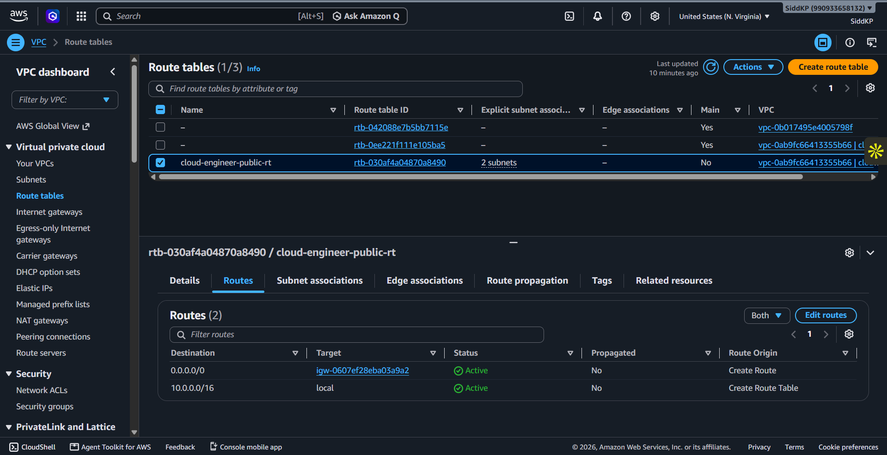

### 5. ALB Security Group

Shows the security group attached to the Application Load Balancer, allowing HTTP traffic on port 80 from the Internet.

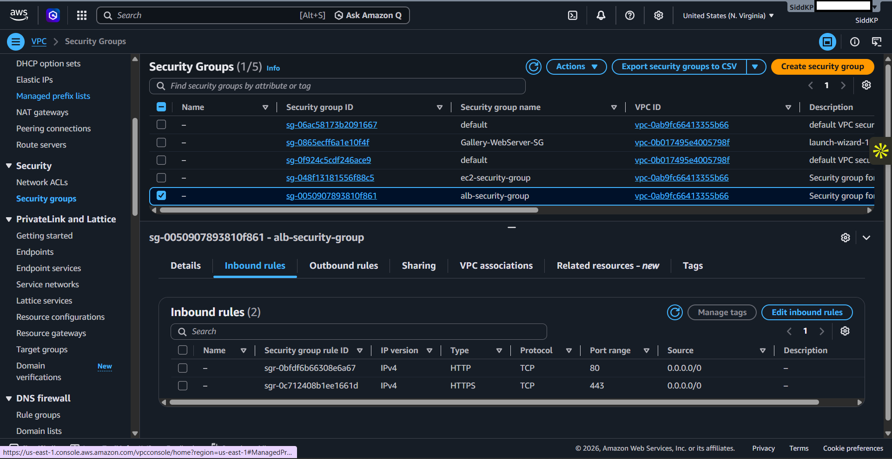

### 6. EC2 Security Group

Shows the security rules for the EC2 instances, allowing SSH access from the administrator's IP and HTTP traffic from the ALB security group.

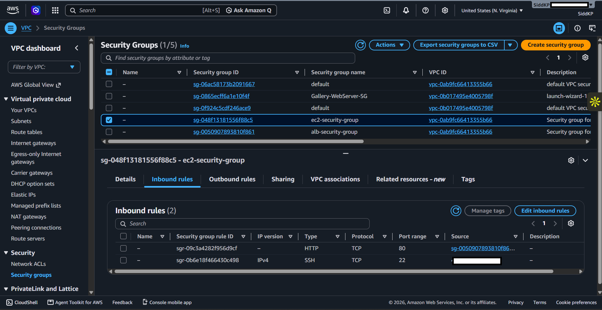

### 7. EC2 Instances

Shows the two Amazon EC2 web servers running in separate Availability Zones, providing redundancy for the application.

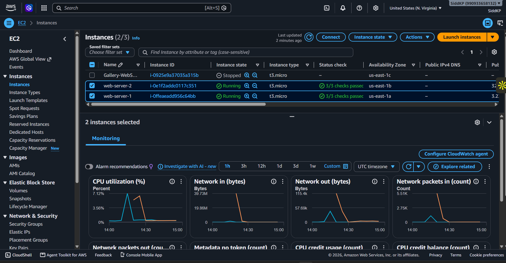

### 8. Target Group

Shows the target group containing the two EC2 web servers. The target group is used by the ALB to perform health checks and route requests.

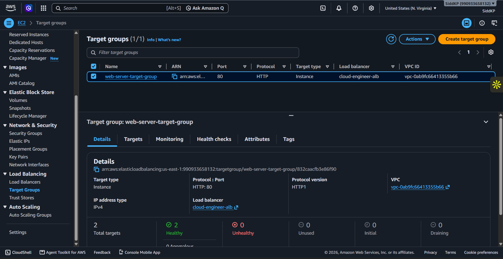

### 9. Application Load Balancer

Shows the internet-facing Application Load Balancer configured to distribute incoming HTTP traffic across the web servers.

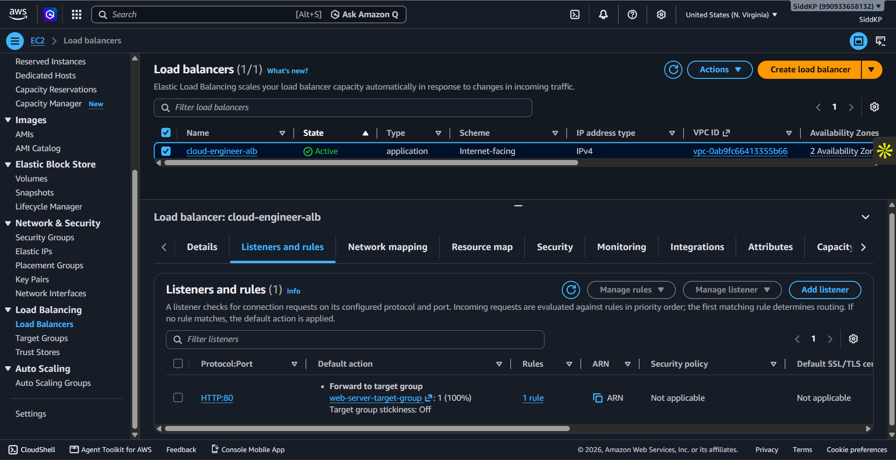

### 10. ALB Website

Shows the web application successfully accessed through the Application Load Balancer DNS name, demonstrating that the ALB is forwarding traffic to an EC2 instance.

### 11. High Availability — Unhealthy Target

Shows the target group after one EC2 instance was stopped, with one target becoming unhealthy while the other remains healthy.

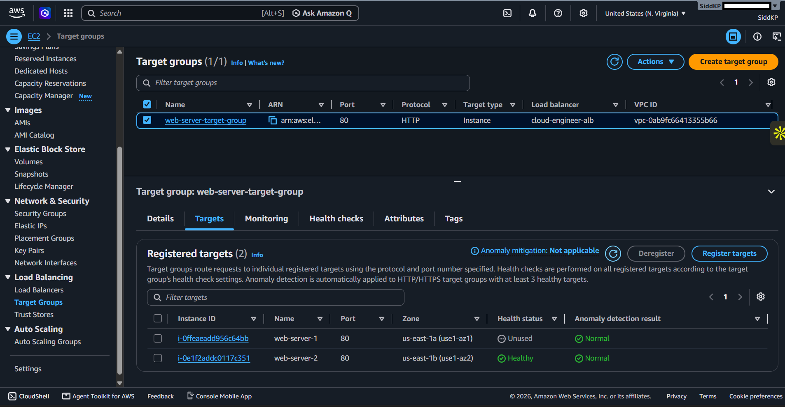

### 12. High Availability — Website Continues Working

Shows that the application remains accessible through the ALB even after one EC2 instance becomes unhealthy. Traffic continues to the healthy EC2 instance.

### 13. Restored Targets

Shows both EC2 instances becoming healthy again after the stopped instance was restarted, confirming successful recovery.

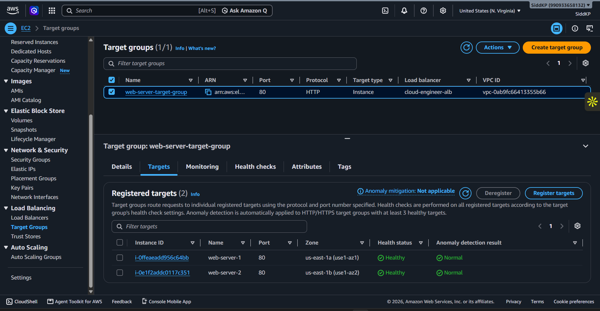